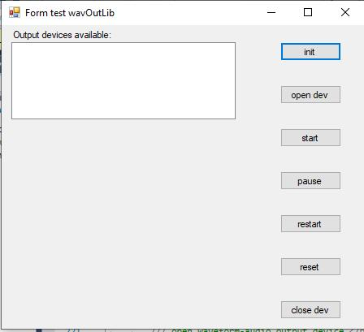

# wavaudio

Playback of in memory audio.
There are three projects. Project Wav is made to read (Microsoft) wav-files. Project WavOutLib uses the winmm.dll library to
create a library with the class WavOutPlayer. The project TestWavOut has a 'test-program' with a form Form1 and a file wavFile.cs. 

## project Wav

A wav-file can be read. It can be written. And a Convert method is added to convert between 16, 24 and float encodings. A class
Framereader is added to make it easy to think in terms of frames and not in terms of bytes. The testform uses the Wav class
to read sound from file.

## testform

The layout of the form is as follows:

In the Init() an object of class WavOutPlayer is created and the listbox is filled
with available output devices.

In the Open dev() a wav file (Toccata-and-fugue-Short.wav) is opened. The format information of the wav-file is used
to create the format for the output device (stereo/mono, bitcount in encoding, samples/second), and this is passed
when creating a handle to one of the available output devices.

It is possible to Pause() and Restart() the audio.

And it is possible to Reset() the audio. After that we can play another tune without closing the output device.

## using the WavOutPlayer class

The wavOutPlayer uses a number of buffers that must be filled with audio-bytes. When playing one buffer it will try to fill the other buffers at the same time. In the example test program we made the following choices:

* const int HeaderCount = 6; This means that we use 6 buffers in the player
* dataProvider = new LoopedDataProvider(...); This means that we use a LoopDataProvider to fill the buffers. In a WavOutPlayer we use a subclass of BufferDataProvider to fill the buffers of the player. A loopDataProvider will loop between a startFrame and an EndFrame. 
* new LoopedDataProvider(..., 2200 ,...); this means that the buffers have a size of 2200 frames

Do not make the number of buffers too small or the length of the buffers too small. On my laptop I had (Count_of_buffers - 1) x (Buffer_Size) must be greater than 900. So, there are limits. With 6 buffers and the rather small buffer size of 2200 frames my laptop played the Toccata for 3 hours without a problem.

## other sound APIs

When it is important to have low latency then other window API's come to the rescue. The Core Audio APIs were introduced in Windows Vista (they will not be supported on XP and lower versions) and other API's were built on top of these Core Audio APIs... [more information](https://docs.microsoft.com/en-gb/windows/win32/coreaudio/about-the-windows-core-audio-apis)

